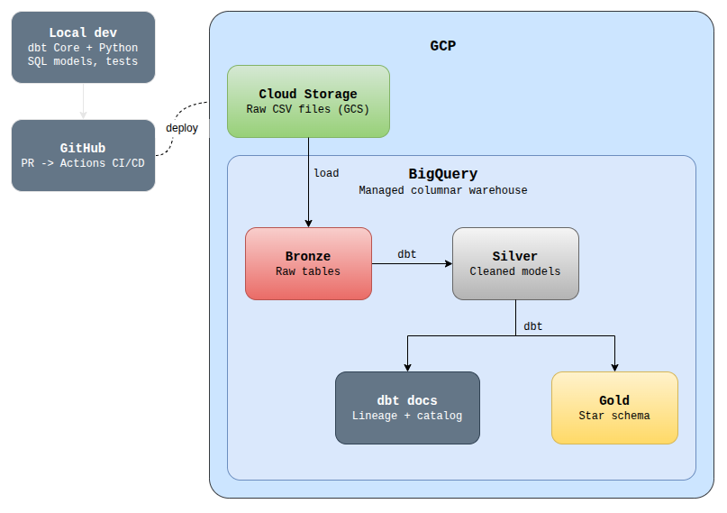

# Olist Analytics Engineering

An end-to-end analytics engineering platform built on the [Olist Brazilian E-Commerce](https://www.kaggle.com/datasets/olistbr/brazilian-ecommerce) public dataset. This project migrates the data warehouse built in [Phase 1](https://github.com/cardonajsebas/olist-data-warehouse) to a production-grade cloud stack using **dbt**, **BigQuery**, and **GCP**, with CI/CD automation through **GitHub Actions**.

> Built as a portfolio project to demonstrate analytics engineering practices including cloud infrastructure, transformation pipelines, data quality testing, and deployment automation.

---

## Context

This project is the second phase of a data warehouse initiative. Phase 1 established the data model and ETL pipeline using PostgreSQL and a Medallion Architecture (Bronze, Silver, Gold). 
The architecture and migration plan were designed prior to implementation and are documented in the [Roadmap](#roadmap) section below. Phase 2 lifts that foundation to the cloud, replacing manual SQL scripts with dbt models and introducing automated testing and deployment.

If you are not familiar with Phase 1, it is recommended to review it first: 
[olist-data-warehouse](https://github.com/cardonajsebas/olist-data-warehouse).

---

## Architecture



| Layer | Tool | Description |
|---|---|---|
| Storage | GCS | Raw CSV files stored as the landing zone |
| Warehouse | BigQuery | Columnar analytical engine hosting all layers |
| Transformation | dbt Core | Models, tests, and documentation across Bronze, Silver, and Gold |
| Orchestration | Python + GCS | Initial load scripts; scheduling TBD |
| CI/CD | GitHub Actions | Automated testing and deployment on pull requests and merges |
| Documentation | dbt docs | Auto-generated data catalog and lineage graph |

---

## Data Layers

Following the same Medallion Architecture established in Phase 1, now implemented as dbt models materialized in BigQuery.

| Layer | Materialization | Description |
|---|---|---|
| Bronze | Table | Raw data loaded from GCS as-is, no transformations |
| Silver | Table | Cleaned, typed, and standardized models (1:1 with Bronze) |
| Gold | View | Business-ready Star Schema for analytical consumption |

---

## Tech Stack

| Tool | Purpose |
|---|---|
| **dbt Core** | Data transformation, testing, and documentation |
| **BigQuery** | Cloud data warehouse (analytical layer) |
| **Google Cloud Storage** | Raw data landing zone |
| **Google Cloud Platform** | Cloud infrastructure and IAM |
| **GitHub Actions** | CI/CD pipeline for automated testing and deployment |
| **Python** | GCS ingestion scripts and environment setup |

---

## Project Status

This project is tracked on [GitHub Projects](https://github.com/cardonajsebas/olist-analytics-engineering/projects).

| Milestone | Description | Status |
|---|---|---|
| 1 - GCP Foundation & Raw Ingestion | Cloud infrastructure setup and raw data loading into BigQuery Bronze | Done |
| 2 - dbt Setup & Silver Layer | dbt project initialization and Bronze-to-Silver transformation models | Done |
| 3 - dbt Gold Layer & Data Quality | Star Schema models and automated data quality tests | In progress |
| 4 - CI/CD with GitHub Actions | Automated testing and deployment pipeline | Planned |
| 5 - Documentation & Portfolio Polish | dbt docs site, lineage graph, and README completion | Planned |

---

## Repository Structure

```
olist-analytics-engineering/
│
├── .github/
│   └── workflows/                  # GitHub Actions CI/CD workflows
│
├── ingestion/                      # Python scripts for GCS and BigQuery loading
│
├── olist_dbt/                      # dbt project root
│   ├── models/
│   │   ├── bronze/                 # Raw ingestion models
│   │   ├── silver/                 # Cleaning and standardization models
│   │   └── gold/                   # Analytical Star Schema models
│   ├── tests/                      # Custom dbt tests
│   ├── macros/                     # Reusable dbt macros
│   ├── docs/                       # dbt model documentation (.md files)
│   ├── dbt_project.yml
│   └── profiles.yml.example
│
├── docs/                           # Architecture diagrams and project documentation
│
├── .env.example
├── README.md
└── LICENSE
```

---

## Prerequisites

- GCP account with billing enabled
- `gcloud` CLI installed and authenticated (`gcloud auth login`)
- Python 3.10+
- dbt Core with BigQuery adapter (`dbt-bigquery`)
- A service account JSON key with the following roles:
  - `roles/storage.objectAdmin`
  - `roles/bigquery.dataEditor`
  - `roles/bigquery.jobUser`

See [docs/setup.md](docs/setup.md) for step-by-step setup instructions.

---

## How to Run

### 1. Environment setup
Follow [docs/setup.md](docs/setup.md) to configure GCP credentials and the dbt profile.

### 2. Install dependencies
```bash
python3 -m venv .venv
source .venv/bin/activate
pip install -r requirements.txt
```

### 3. Load Bronze layer
```bash
python ingestion/load_bronze.py
```

### 4. Run Silver models
```bash
cd olist_dbt
dbt run --select 'silver' --profiles-dir ~/.dbt
```

### 5. Validate Bronze load
```bash
bq query --project_id=YOUR_PROJECT_ID --use_legacy_sql=false \
  < ingestion/validation/validate_row_counts.sql
```

---

## Roadmap

**Milestone 1 - GCP Foundation & Raw Ingestion**

Set up the GCP project, enable required services, configure IAM, create the GCS bucket and BigQuery datasets, and build Python scripts to load the 9 raw Olist CSVs into BigQuery Bronze tables.

**Milestone 2 - dbt Setup & Silver Layer**

Initialize the dbt project connected to BigQuery. Migrate Bronze-to-Silver cleaning logic from Phase 1 SQL scripts into dbt models, applying correct materializations and source definitions.

**Milestone 3 - dbt Gold Layer & Data Quality**

Build the Star Schema (fact and dimension models) as dbt Gold models. Implement dbt generic and singular tests covering completeness, uniqueness, referential integrity, and business rule validation.

**Milestone 4 - CI/CD with GitHub Actions**

Configure GitHub Actions to run `dbt test` on every pull request and `dbt run` on every merge to main. Introduce environment separation between dev and prod BigQuery datasets.

**Milestone 5 - Documentation & Portfolio Polish**

Generate and publish the dbt documentation site to GitHub Pages. Complete the data catalog, model descriptions, and column-level documentation. Finalize the README.

---

## Credits

This project extends the work from [olist-data-warehouse](https://github.com/cardonajsebas/olist-data-warehouse), which was developed following the methodology of **Baraa Khatib Salkini** ([Data With Baraa](https://www.datawithbaraa.com)).

The Olist dataset is sourced from [Kaggle](https://www.kaggle.com/datasets/olistbr/brazilian-ecommerce) and licensed under [CC BY-NC-SA 4.0](https://creativecommons.org/licenses/by-nc-sa/4.0/).

---

## License

This project is licensed under the [MIT License](LICENSE). You are free to use, modify, and distribute it with proper attribution.

---

## About

Built by **John S Cardona** as a portfolio project demonstrating analytics engineering skills on a cloud-native stack.

[](https://linkedin.com/in/sebastian-cardona)
[](https://cardonajsebas.github.io/)
[](https://github.com/cardonajsebas)